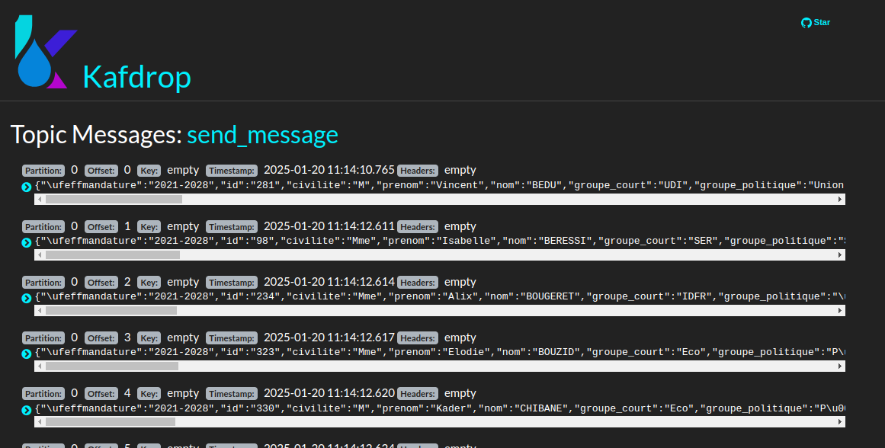
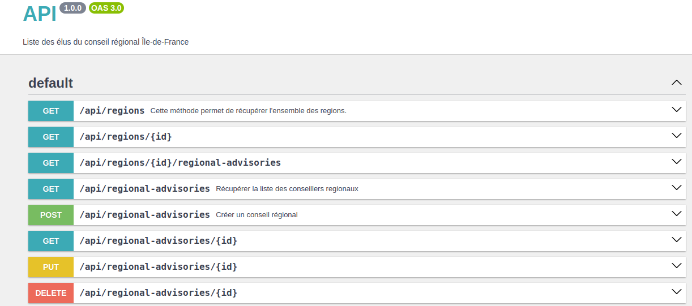

# Appication 1 (kafka-producer): PRODUCER 
# Appication 2 (api):  API REST + CONSUMER

Ce projet est une API REST qui permet la gestion des élus du [conseil régional de l'Île-de-France](https://www.data.gouv.fr/fr/datasets/liste-des-conseillers-regionaux-1/)
Il utilise **Apache Kafka** pour la gestion des messages et **MySQL** comme base de données.  

## Prérequis

Avant de commencer, assurez-vous d'avoir installé les éléments suivants :

- [PHP 8.1+](https://www.php.net/downloads.php)
- [Composer](https://getcomposer.org/)
- [Symfony CLI](https://symfony.com/download)
- [Docker](https://www.docker.com/)
- [Apache Kafka](https://kafka.apache.org/)
- [MySQL](https://dev.mysql.com/downloads/)
- [OpenRefine](https://openrefine.orgdownload/) (Nettoyage des données)

---

## Installation du projet


1. **Cloner le projet**  
```bash
   git clone git@github.com:snlabs/integration-evolution-si.git
   cd integration-evolution-si
```
3. **Lancer les  deux application** 
```bash   
make start
```
3. **Installer les dépendances**

Application 2:
 ```bash
  make ssh
  composer install
```
Application 1 :

```bash
make ssh2 
composer install    
```

**Injection de données et Publier des messages Kafka via  Command (kafka-producer))** 

```bash
make ssh2 
php bin/console app:imported-published-Kafka var/liste-des-conseillers-regionaux.csv
```
Les messages disponibles dans Kafka peuvent être consultés via l'interface Kafdrop à l'adresse suivante : 

```bash
http://localhost:9900/
```



Les messages disponibles dans Kafka peuvent être consultés via l'interface Kafdrop à l'adresse suivante :
```bash
http://localhost:9900/
```

Assurez-vous que le broker est bien en marche et que le topic est correct :

```bash
docker exec -it kafka /bin/sh

kafka-topics  --list --bootstrap-server kafka:9092
```

3. **Créer la base de données et les tables**     
```bash
make ssh (application api)
php bin/console doctrine:database:create
php bin/console doctrine:migrations:migrate  
```
La base de donnéee sera disponible sur 
```bash
http://127.0.0.1:8899/
```

**Consommer les messages Kafka (api)**

```bash
make ssh
php bin/console kafka:consumer:run send_message
```

L'API sera disponible sur 
```bash
http://127.0.0.1:8001/
```

**Documentation de l'API (Swagger)** 

La documentation est accessible sur 
http://127.0.0.1:8001/api/doc

